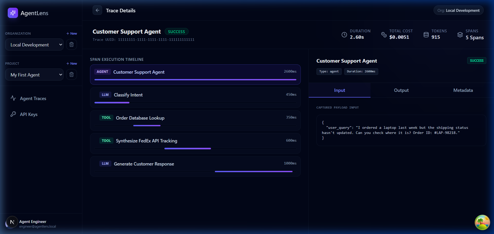
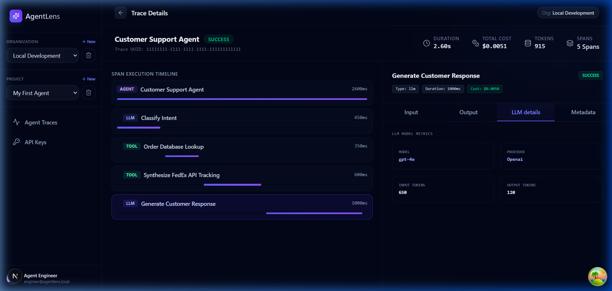
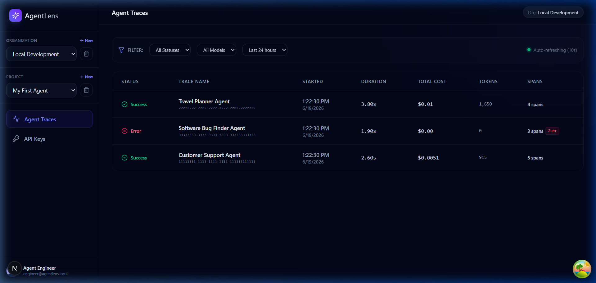

<div align="center">

# 🔍 AgentLens

### Real-Time Observability & Tracing for AI Agents

[](https://python.org)
[](https://fastapi.tiangolo.com)
[](https://nextjs.org)
[](https://postgresql.org)
[](https://redis.io)
[](https://docker.com)
[](.)
[](LICENSE)

**Capture trace hierarchies · Analyze nested tool calls · Monitor token costs in real-time**

---

## 👀 See It In Action

**Every LLM call, tool execution, and cost — automatically captured.**

<table>
<tr>
<td width="50%">

**Hierarchical span tree with live timing**



</td>
<td width="50%">

**Per-span token counts and cost breakdown**



</td>
</tr>
</table>



---

[Quick Start](#-quick-start) · [SDK Usage](#-sdk-usage) · [API Reference](#-api-reference) · [Architecture](#-architecture) · [Testing](#-testing--quality)

</div>

---

## ✨ Features

- 🔄 **Real-Time Streaming** — WebSocket-powered live span updates via Redis Pub/Sub
- 🌳 **Hierarchical Trace Trees** — Nested parent-child span relationships with Gantt chart visualization
- 💰 **Automatic Cost Tracking** — Built-in pricing engine for OpenAI & Anthropic models with automatic CometAPI catalog pricing sync
- 🔌 **Zero-Config Instrumentation** — Monkey-patch OpenAI, Anthropic, CometAPI gateways, and LangGraph with a single function call
- 🔀 **Trace Diffing** — Side-by-side execution comparison and diff visualization for prompt/model iterations
- 🛠️ **Tool Span Inspector** — Dedicated tool execution details view for input/output payloads and error diagnosis
- 🔐 **Multi-Tenant Security** — Clerk-based authentication, org/project scoping, and tenant-isolated API keys
- ⚡ **Non-Blocking SDK** — Thread-safe daemon worker with background queue for zero-overhead tracing
- 🧪 **Premium Test Suite** — 63 tests covering unit, integration, property-based (Hypothesis), and smoke testing
- 📊 **Cursor Pagination** — Efficient, production-grade pagination for trace listing endpoints

---

## 🏗 Architecture

AgentLens is built as a production-grade monorepo with three core components:

```
┌─────────────────────────────────────────────────────────────────┐
│                        Developer's Code                         │
│                                                                 │
│   import agentlens as al                                        │
│   al.init(api_key="al_live_...")                                │
│   al.instrument_openai()                                        │
│                                                                 │
│   @al.trace(name="My Agent")                                    │
│   def run():                                                    │
│       client.chat.completions.create(...)                       │
└──────────────────────────┬──────────────────────────────────────┘
                           │  HTTP POST /v1/ingest
                           ▼
┌──────────────────────────────────────────────────────────────────┐
│                     FastAPI Backend (apps/api)                    │
│                                                                  │
│  ┌──────────┐  ┌──────────┐  ┌───────────┐  ┌────────────────┐  │
│  │  Ingest  │  │  Traces  │  │  API Keys │  │   WebSocket    │  │
│  │  Router  │  │  Router  │  │  Router   │  │   /v1/ws/...   │  │
│  └────┬─────┘  └────┬─────┘  └─────┬─────┘  └───────┬────────┘  │
│       │              │              │                │            │
│       ▼              ▼              ▼                ▼            │
│  ┌──────────────────────────────────────────────────────────┐    │
│  │              Service Layer (business logic)              │    │
│  └─────────────────────┬────────────────────────────────────┘    │
│                        │                                         │
│       ┌────────────────┼────────────────┐                        │
│       ▼                ▼                ▼                        │
│  ┌─────────┐     ┌──────────┐    ┌──────────┐                   │
│  │ Postgres│     │  Redis   │    │  Clerk   │                   │
│  │  (data) │     │ (cache/  │    │  (auth)  │                   │
│  │         │     │  pubsub) │    │          │                   │
│  └─────────┘     └──────────┘    └──────────┘                   │
└──────────────────────────────────────────────────────────────────┘
                           │  React Query + WebSocket
                           ▼
┌──────────────────────────────────────────────────────────────────┐
│                  Next.js Dashboard (apps/web)                    │
│                                                                  │
│  ┌──────────────┐  ┌──────────────┐  ┌────────────────────────┐  │
│  │  Trace List  │  │ Gantt Chart  │  │   Span Inspector      │  │
│  │  (filtered)  │  │ (real-time)  │  │   (tokens/cost/IO)    │  │
│  └──────────────┘  └──────────────┘  └────────────────────────┘  │
└──────────────────────────────────────────────────────────────────┘
```

| Component | Stack | Purpose |
|-----------|-------|---------|
| **Backend API** | FastAPI, SQLAlchemy (async), asyncpg, Alembic, Redis | Ingestion pipeline, trace queries, WebSocket streaming, auth |
| **Frontend** | Next.js 15, TypeScript, TailwindCSS, TanStack Query, Clerk | Interactive dashboard with Gantt charts and span inspector |
| **Python SDK** | httpx, structlog, threading | Non-blocking trace capture with auto-instrumentation |

---

## 📁 Project Structure

```
agentlens/
├── docker-compose.yml              # Orchestrates all 4 services
├── Makefile                         # Developer shortcuts (make dev, make test, etc.)
├── LICENSE                          # MIT license
├── .env.example                     # Template for environment variables
├── .env.local.example               # Zero-setup local dev config (LOCAL_MODE=true)
├── .gitignore
│
├── apps/
│   ├── api/                         # ── FastAPI Backend ──────────────────
│   │   ├── Dockerfile               # Python 3.11-slim container
│   │   ├── pyproject.toml           # Dependencies & tool config (ruff, pytest)
│   │   ├── uv.lock                  # Locked dependency versions for reproducible installs
│   │   ├── .dockerignore            # Excludes .venv, __pycache__, etc. from Docker build context
│   │   ├── alembic.ini              # Alembic migration config
│   │   │
│   │   ├── app/
│   │   │   ├── main.py              # FastAPI app factory, lifespan, router registration
│   │   │   ├── config.py            # Pydantic Settings (DB, Redis, Clerk, rate limits)
│   │   │   ├── database.py          # Async SQLAlchemy engine & session factory
│   │   │   ├── redis_client.py      # Redis async client singleton
│   │   │   ├── exceptions.py        # Custom HTTP exception classes
│   │   │   │
│   │   │   ├── models/              # SQLAlchemy ORM models
│   │   │   │   ├── user.py          #   User (clerk_id, email, name)
│   │   │   │   ├── org.py           #   Organization + OrgMember (RBAC)
│   │   │   │   ├── project.py       #   Project (belongs to org)
│   │   │   │   ├── api_key.py       #   API Key (SHA-256 hashed, revocable)
│   │   │   │   ├── trace.py         #   Trace (aggregated metrics)
│   │   │   │   └── span.py          #   Span (LLM call details, tokens, cost)
│   │   │   │
│   │   │   ├── schemas/             # Pydantic request/response schemas
│   │   │   │   ├── ingest.py        #   IngestRequest, SpanPayload, IngestResponse
│   │   │   │   ├── traces.py        #   TraceList, TraceDetail, SpanTree
│   │   │   │   └── orgs.py          #   OrgCreate, ProjectCreate, APIKeyCreate
│   │   │   │
│   │   │   ├── routers/             # API route handlers
│   │   │   │   ├── health.py        #   GET /health, GET /ready
│   │   │   │   ├── ingest.py        #   POST /v1/ingest (span batch ingestion)
│   │   │   │   ├── traces.py        #   GET /v1/traces, GET /v1/traces/{id}
│   │   │   │   ├── api_keys.py      #   CRUD for API keys
│   │   │   │   ├── orgs.py          #   Org/project management
│   │   │   │   └── ws.py            #   WebSocket /v1/ws/traces/{id}
│   │   │   │
│   │   │   ├── services/            # Business logic layer
│   │   │   │   ├── ingest.py        #   resolve_trace, bulk_insert, publish_spans
│   │   │   │   ├── traces.py        #   Cursor pagination, span tree builder
│   │   │   │   └── api_keys.py      #   Key generation (al_live_*), SHA-256 hashing
│   │   │   │
│   │   │   └── middleware/           # Cross-cutting concerns
│   │   │       ├── auth.py          #   Clerk JWT + API key auth, rate limiting
│   │   │       ├── cors.py          #   CORS configuration
│   │   │       └── logging.py       #   Structured JSON logging (structlog)
│   │   │
│   │   ├── migrations/              # Alembic database migrations
│   │   │   ├── env.py
│   │   │   ├── script.py.mako
│   │   │   └── versions/
│   │   │       └── 001_initial_schema.py
│   │   │
│   │   └── tests/                   # Backend test suite (43 tests)
│   │       ├── conftest.py          # Shared pytest fixtures (mock DB, mock Redis, test client)
│   │       │
│   │       ├── unit/                # (contains __init__.py for pytest discovery)
│   │       │   ├── test_api_keys.py     # Key format, hashing, uniqueness
│   │       │   ├── test_ingest.py       # Batch limits, auth, rate limiting
│   │       │   └── test_traces.py       # Cursor encoding, auth, tenant isolation
│   │       ├── integration/         # (contains __init__.py for pytest discovery)
│   │       │   └── test_integration.py  # Full ingest→query roundtrip
│   │       ├── property/            # (contains __init__.py for pytest discovery)
│   │       │   ├── test_auth_properties.py       # JWT/key format invariants
│   │       │   ├── test_ingest_properties.py     # Batch count, idempotency
│   │       │   ├── test_query_properties.py      # Pagination, tenant isolation
│   │       │   └── test_serialization_props.py   # Span payload round-trip
│   │       └── smoke/               # (contains __init__.py for pytest discovery)
│   │           └── test_schema.py       # Table existence, index verification
│   │
│   └── web/                         # ── Next.js Frontend ─────────────────
│       ├── Dockerfile               # Node 20-slim container
│       ├── package.json             # Dependencies (clerk, tanstack-query, etc.)
│       ├── tsconfig.json
│       ├── next.config.ts
│       ├── middleware.ts            # Clerk auth middleware for route protection
│       │
│       └── app/                     # Next.js App Router pages
│           ├── layout.tsx           #   Root layout (ClerkProvider + Providers)
│           ├── page.tsx             #   Landing / redirect page
│           ├── globals.css          #   Global styles
│           ├── providers.tsx        #   React Query + Devtools provider
│           ├── dashboard/
│           │   └── page.tsx         #   Main dashboard (traces, Gantt, inspector)
│           ├── onboarding/
│           │   └── page.tsx         #   Org + project creation flow
│           ├── sign-in/
│           │   └── [[...sign-in]]/page.tsx
│           └── sign-up/
│               └── [[...sign-up]]/page.tsx
│
├── docs/
│   └── production-setup.md          # Clerk setup + multi-tenant production deployment guide
│
└── packages/
    └── python-sdk/                  # ── AgentLens Python SDK ─────────────
        ├── pyproject.toml           # Package metadata & dependencies
        ├── README.md                # SDK-specific documentation
        │
        ├── agentlens/
        │   ├── __init__.py          # Public API: init(), trace(), flush(), instrument_*()
        │   ├── client.py            # HTTP client + background queue worker
        │   ├── context.py           # contextvars for trace_id / span_id propagation
        │   ├── decorators.py        # @al.trace() decorator implementation
        │   ├── pricing.py           # Cost lookup tables (OpenAI, Anthropic models)
        │   └── instruments/
        │       ├── openai.py        #   Monkey-patch for openai.ChatCompletions
        │       └── anthropic.py     #   Monkey-patch for anthropic.Messages
        │
        └── tests/                   # SDK test suite (12 tests)
            ├── unit/
            │   └── test_queue.py        # Queue worker, flush, thread safety
            └── property/
                ├── test_pricing_properties.py   # Cost calculation invariants
                └── test_sdk_properties.py       # Payload structure invariants
```

---

## 🚀 Quick Start

```bash
git clone https://github.com/kp183/agentlens.git
cd agentlens
cp .env.local.example .env   # works immediately, no accounts needed
docker compose up --build
# Dashboard at http://localhost:3000
```

```bash
pip install agentlens-py
```

> [!NOTE]
> Note that the package is installed via `agentlens-py`, but the Python import name remains `import agentlens as al`.

```python
import agentlens as al
al.init(api_key="local-dev-key", base_url="http://localhost:8000")
al.instrument_openai()
# Your traces appear at http://localhost:3000
```

For production deployment and multi-tenant authentication using Clerk, see [docs/production-setup.md](docs/production-setup.md).

See [CometAPI integration write-up](docs/cometapi-integration/cometapi-integration-writeup.md) for a real end-to-end example with multi-provider fallback and cost tracking.

---

## 📦 SDK Usage

### Installation

```bash
pip install agentlens-py
```

> [!NOTE]
> Note that the package is installed via `agentlens-py`, but the Python import name remains `import agentlens as al`.

### Basic Example

```python
import agentlens as al
import openai

# 1. Initialize with your API key
al.init(
    api_key="al_live_YOUR_API_KEY",
    base_url="http://localhost:8000"  # optional, for local dev
)

# 2. Auto-instrument LLM clients (one line each)
al.instrument_openai()
al.instrument_anthropic()  # if using Anthropic

# 3. Wrap your agent logic with @al.trace()
@al.trace(name="Customer Support Agent")
def handle_ticket(issue: str):
    client = openai.OpenAI()

    @al.trace(name="Classify Intent")
    def classify():
        return client.chat.completions.create(
            model="gpt-4o-mini",
            messages=[{"role": "user", "content": f"Classify: {issue}"}]
        )

    @al.trace(name="Generate Response")
    def respond(intent):
        return client.chat.completions.create(
            model="gpt-4o",
            messages=[{"role": "user", "content": f"Respond to {intent}"}]
        )

    intent = classify()
    response = respond(intent)
    return response

# 4. Run and flush
handle_ticket("I can't access my account")
al.flush()  # Ensure all spans are sent before exit
```

### What Gets Captured Automatically

| Field | Description |
|-------|-------------|
| `trace_id` | Groups related spans into a single trace |
| `span_id` | Unique identifier for each operation |
| `parent_span_id` | Links child spans to parents (trace tree) |
| `model` | LLM model used (e.g., `gpt-4o-mini`) |
| `input_tokens` / `output_tokens` | Token consumption from the API response |
| `cost_usd` | Automatically calculated from built-in pricing tables |
| `duration_ms` | Wall-clock execution time |
| `input` / `output` | Prompt messages and completion responses |
| `status` | `success` or `error` with stack trace on failure |

---

## 🔌 API Reference

### Ingestion

| Method | Endpoint | Auth | Description |
|--------|----------|------|-------------|
| `POST` | `/v1/ingest` | API Key (`Bearer al_live_...`) | Batch ingest up to 500 spans |

### Traces & Spans

| Method | Endpoint | Auth | Description |
|--------|----------|------|-------------|
| `GET` | `/v1/traces` | Clerk JWT | List traces with cursor pagination & filters |
| `GET` | `/v1/traces/{id}` | Clerk JWT | Get trace detail with aggregated metrics |
| `GET` | `/v1/traces/{id}/spans` | Clerk JWT | Get hierarchical span tree |

### Real-Time Streaming

| Protocol | Endpoint | Auth | Description |
|----------|----------|------|-------------|
| `WebSocket` | `/v1/ws/traces/{id}` | JWT or API Key (sent as first message) | Live span streaming via Redis Pub/Sub |

**Connecting:**
```javascript
const ws = new WebSocket(`ws://localhost:8000/v1/ws/traces/${traceId}`)
ws.onopen = () => {
  // Send auth token as the first message — never in the URL
  ws.send(JSON.stringify({ token: yourJwtOrApiKey }))
}
ws.onmessage = (event) => {
  const { type, data } = JSON.parse(event.data)
  // type is "span" or "trace_ended"
}
```

### Organization & Project Management

| Method | Endpoint | Auth | Description |
|--------|----------|------|-------------|
| `POST` | `/v1/orgs` | Clerk JWT | Create organization |
| `GET` | `/v1/orgs` | Clerk JWT | List user's organizations |
| `POST` | `/v1/projects` | Clerk JWT | Create project (body: `{"org_id": "...", "name": "...", "slug": "..."}`) |
| `GET` | `/v1/projects` | Clerk JWT | List projects (query: `?org_id={org_id}`) |

### API Key Management

| Method | Endpoint | Auth | Description |
|--------|----------|------|-------------|
| `POST` | `/v1/api-keys` | Clerk JWT | Generate new API key (body: `{"project_id": "...", "name": "..."}`) |
| `GET` | `/v1/api-keys` | Clerk JWT | List keys (query: `?project_id={project_id}`, prefix only) |
| `DELETE` | `/v1/api-keys/{id}` | Clerk JWT | Revoke a key |

### Health

| Method | Endpoint | Auth | Description |
|--------|----------|------|-------------|
| `GET` | `/health` | None | Basic liveness check |
| `GET` | `/ready` | None | Database + Redis connectivity |

All responses follow the envelope format: `{"data": ..., "meta": {...}}`

---

## 🧪 Testing & Quality

The test suite includes **44 backend tests** and **19 SDK tests** (63 total) spanning four testing strategies:

```bash
# Run everything
docker compose exec api pytest -v

# Run specific test categories
docker compose exec api pytest tests/unit/ -v          # Unit tests
docker compose exec api pytest tests/integration/ -v   # Integration tests
docker compose exec api pytest tests/property/ -v      # Property-based tests
docker compose exec api pytest tests/smoke/ -v          # Schema verification
```

| Category | Tests | What's Covered |
|----------|-------|----------------|
| **Unit** | 21 | API key format/hashing, ingestion validation, cursor encoding, auth checks |
| **Integration** | 3 | Full ingest → query roundtrip, API key lifecycle |
| **Property** | 16 | Format invariants, batch counting, tenant isolation, serialization (Hypothesis) |
| **Smoke** | 4 | Table existence, index verification, GIN index type, partial index validation |

### Using Make shortcuts

```bash
make test    # Run all tests (API + SDK)
make lint    # Run ruff linter and format checks
make dev     # Start all services with hot reload
make logs    # Follow logs from all services
make db-shell  # Open psql shell in Postgres container
```

---

## 🔒 Security Model

- **API Keys**: Generated with `secrets.token_urlsafe(32)`, SHA-256 hashed before storage, prefixed with `al_live_`
- **Authentication**: Dual-path — Clerk JWTs for dashboard users in production (API keys always required for SDK ingestion regardless of mode). For local development, set LOCAL_MODE=true to bypass Clerk entirely with a zero-config dev user — see Quick Start.
- **Tenant Isolation**: Every query enforces `project_id` scoping; cross-org access returns `403`
- **Rate Limiting**: Redis-backed sliding window, configurable per-key (default: 1000 req/min)
- **Key Revocation**: Instant revocation with Redis cache invalidation (300s TTL)
- **CORS**: Explicit allowlist, no wildcards

---

## 🛠 Development Commands

```bash
# Start development environment
docker compose up --build

# Run database migrations
docker compose exec api alembic upgrade head

# Create a new migration
docker compose exec api alembic revision --autogenerate -m "description"

# Open database shell
docker compose exec postgres psql -U agentlens -d agentlens

# Install SDK in API container (for running test scripts)
docker compose exec api pip install -e /sdk
docker compose exec api pip install openai  # for mock tests
```

---

## 📄 License

MIT

---

<div align="center">

Built with ❤️ using FastAPI, Next.js, and PostgreSQL

</div>