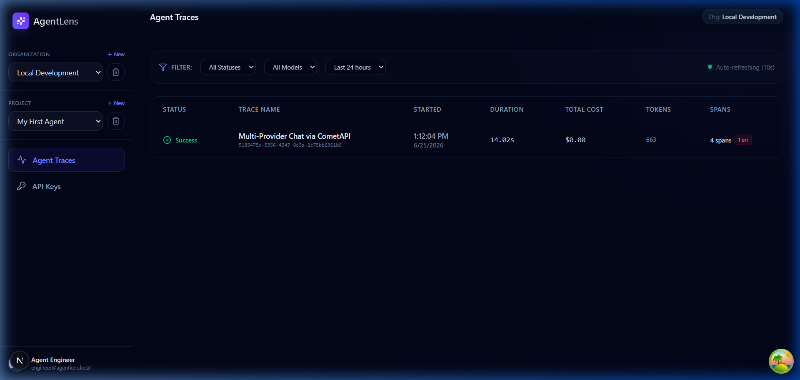
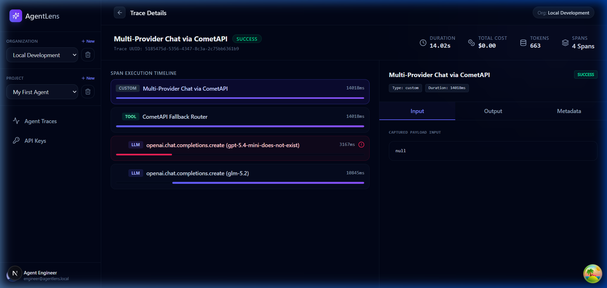
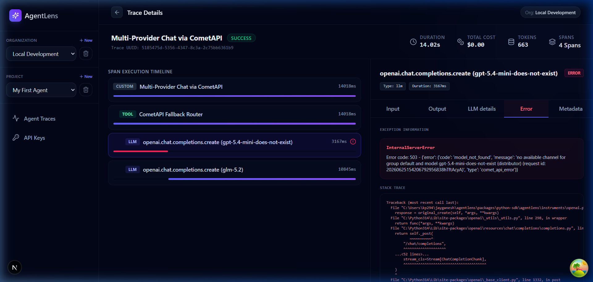
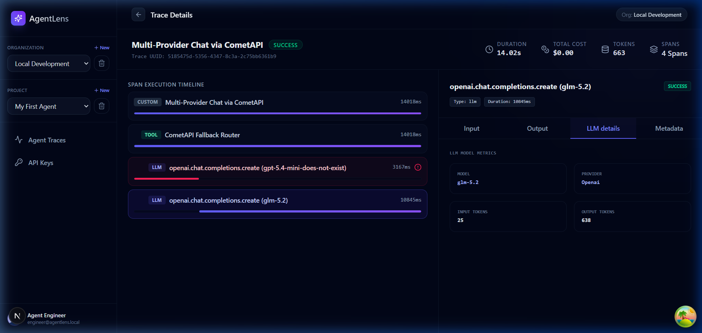
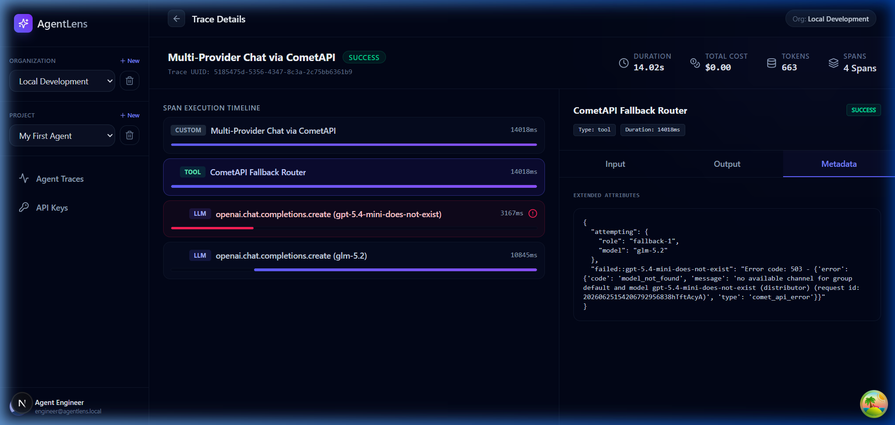
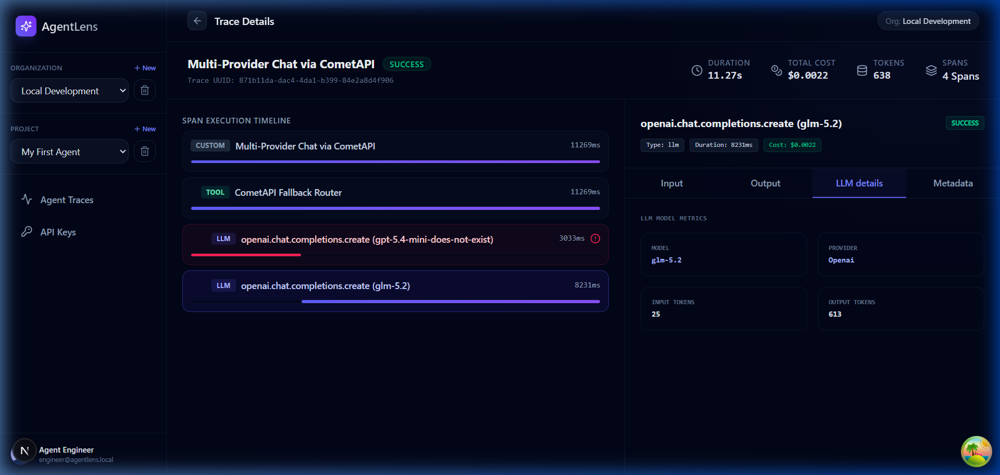

# Tracing CometAPI-Routed Agents with AgentLens

A small integration test: can AgentLens transparently observe an agent that's using
CometAPI to route across multiple model providers — including when a model fails
and the agent falls back to another one? Short answer: yes, with zero special-case
code. Along the way we also found two real gaps, and fixed both.

## The setup

AgentLens auto-instruments the OpenAI Python client at the library level. Since
CometAPI speaks the same protocol, pointing that exact client at CometAPI's
`base_url` instead of `api.openai.com` means every call still gets traced —
no custom adapter, no special-cased integration code.

We built a small fallback router on top of that: try model A, if it fails move to
model B, and so on — a pattern that maps directly onto two things CometAPI is built
for (provider switching, fallback reliability). One call in the chain was
deliberately pointed at a nonexistent model name, just to force a real failure and
fallback instead of waiting on a real outage.

## What the trace shows


The run completes successfully end to end — `4 spans`, one of them an error, total
duration 14s.


Opening the trace shows the full structure for free: the root call, a `Fallback
Router` tool span, and each model attempt nested underneath as its own LLM span —
one failed, one succeeded.


The failed attempt isn't a simulated error — it's a real `503 model_not_found`
response from CometAPI's own routing layer, captured automatically with full
exception detail.


The fallback model (`glm-5.2`) succeeds, with real token counts captured (25 in,
638 out).


The router span's own metadata shows the whole decision in one place — which model
it tried, which one failed and why, which one it landed on.

## Gap #1: cost showed $0.00

The trace's total cost initially showed **$0.00**, despite 663 real tokens being
billed by CometAPI. AgentLens' built-in pricing table only recognized a fixed list
of native OpenAI/Anthropic model names — any model accessed through a gateway like
CometAPI (`glm-5.2`, `gemini-3.1-pro-preview`, and most of the other 500+ models)
fell outside that table and silently priced at zero.

**Fixed, two ways:**
- Short-term: added verified `glm-5.2` pricing ($1.12/M input, $3.528/M output)
  sourced directly from CometAPI's own model data.
- Properly: CometAPI exposes `GET /api/models`, returning per-model
  `pricing.input` / `pricing.output` for their full catalog (null-safe for models
  without published pricing). We built a sync utility
  (`agentlens.pricing_sync`) that pulls from this endpoint directly, so AgentLens'
  cost tracking now covers CometAPI's catalog without hand-maintaining a table
  model by model.


Same model, same call pattern — cost now shows **$0.0022** instead of $0.00.

## Gap #2: provider mislabeling

The trace initially labeled every call's provider as `"openai"`, even the one
routed through CometAPI to a Z.ai model — because provider was inferred from which
client class was imported, not from the actual endpoint being called.

**Fixed:** provider is now derived from the client's `base_url` at call time —
`cometapi.com` resolves to `"cometapi"`, unrecognized custom gateways resolve to
their hostname rather than being silently mislabeled as OpenAI.

## Try it yourself

```bash
pip install agentlens-py
pip install openai
export AGENTLENS_API_KEY="al_live_..."
export COMETAPI_KEY="sk-..."
python examples/cometapi_agentlens_demo.py

# optional: keep pricing current against CometAPI's full catalog
python -m agentlens.pricing_sync
```

Full script: `examples/cometapi_agentlens_demo.py` in the AgentLens repo.
